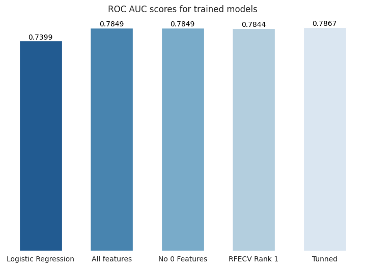
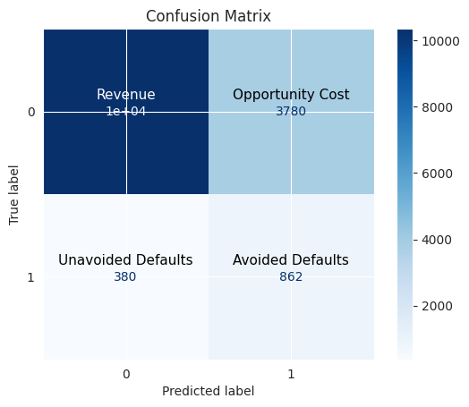
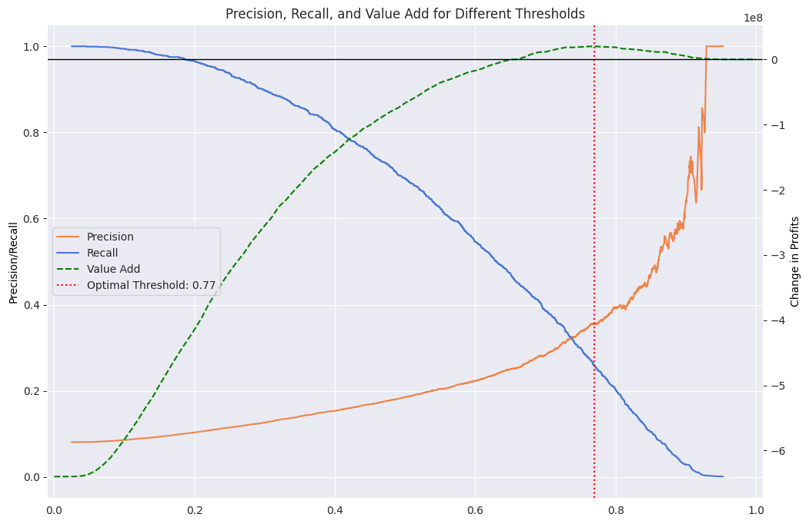
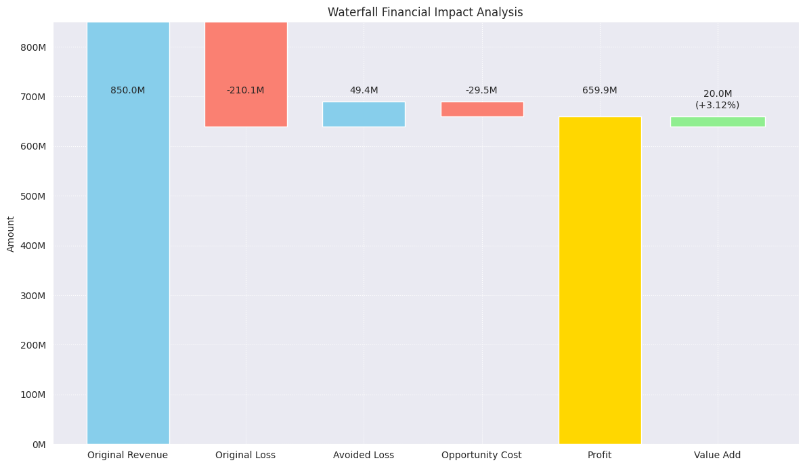

# Home Credit Default Risk Project

## Dataset
The dataset used for this project can be found on [Kaggle](https://www.kaggle.com/c/home-credit-default-risk/data). The dataset contains ~300k credit loans that are labeled as default or not. The dataset also contains additional `csv` files that are from a relational database, and can be connected to the main loans through SK_ID columns.

## Objectives
The main objective of the project is:
>**To develop a Machine Learning model able to predict if new loans are likely to default or not, thus reducing the amount of loan defaults Home Credit has to deal with.**

To achieve this main goal, the following secondary objectives were completed:
1. Perform exploratory data analysis on the loans
2. Formally test hypothesis to confirm assumptions
3. Develop a binary classifier with enough predictive ability for the task
4. Tune the model to Home Credit's business objectives
5. Deploy the trained model so predictions can be made through and API

## Main Insights
From exploratory data analysis and hypothesis testing, the following insights were gathered:
* ~8% of loans default.
* Most of the loans given were **Cash loans** (90%) with the remaining being **Revolving loans** (10%). Interestingly, in previous loans there was a third category called **Consumer loans** which was ~61% of all approved previous loans related to current borrowers.
* As expected, there is a clear linear relationship between the following values in loans: Credit amount, Annuity amount and Goods price.
* We have 3 normalized External Source columns that have high predictive power, but no description.
* From hypothesis testing: there is statistically significant association between having late payments in previous loans with Home Credit and likelihood to default on current loan.

## Model Selection
Two models were built:
1. **Minimalistic Model** - Logistic Regression model, using 35 features from the main loans application file. Highly null features as well as low variance and highly correlated features were dropped. Random Search was used for hyperparameter tunning.
2. **Main Model** - LightGMB classifier. The model was created by aggregating all the features from all the supporting files using featuretools package. Then, Features were selected using a mix of: dropping null and single-value columns, dropping columns with 0 LightGBM importance scores. Then, RFECV (recursive feature elimination with cross-validation) was used and only rank 1 features were selected, giving us 162 features for our final model. Finally, Optuna was used for hyperparameter tunning. This model was selected for deployment.



## Business Metrics

To tune the model for profitability, the following assumptions were made:
* When loan is defaulted, HomeCredit is able to recover 70% of the loan credit amount, thus resulting in a 30% LGD (Loss Given Default).
* Total Rate of Return on a non-default loan is ~10% on the total credit amount, after accounting for related expenses.


Using these assumptions to estimate profits, the threshold was moved to 0.77. From the chart above, we see that adjusting the threshold is crucial. Otherwise, the model would be net negative, and it only produces positive financial value in a specific threshold range (from about 0.65 to 0.91).

In the chart below, we can see the estimated impact on the financials for a sample of ~15k loans in the validation set, given that the model is used at the end of loan application process to indicate the likelihood of default. 



Although ~3% increase in estimated profits is not ground braking results, it can be a very significant improvement for a mature and optimized business such as Home Credit.

## Prediction Service
The model was published using FastAPI, containerized with Docker and uploaded to Googles Artifact Registry.
The published model can be tested here: https://loan-application-service-zem3i4ajwq-lz.a.run.app/docs .

Use the following commands to test how the model predicts (assuming python is installed and final_valid.pkl file is downloaded):
```shell
python deployment/predict_one.py
```
```shell
python deployment/predict_batch.py
```
